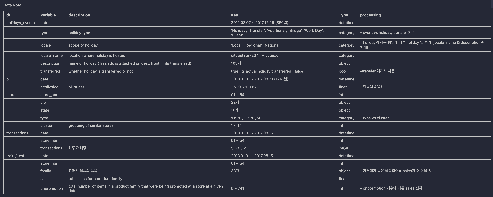

# STUDY-Sales_Feature_Engineering

> [PreProcessing 강의](https://github.com/Chaewon-Leee/TIL/tree/main/ML/Data_Preprocessing) 수강 이후, 데이터 전처리 과정을 진행해보고자 함

### 가게 매출액 예측 프로젝트

- 애콰도르의 위치한 가게 품목별 매출액 예측

- **Data info**

  - [Store Sales - Time Series Forecasting](https://www.kaggle.com/competitions/store-sales-time-series-forecasting/submissions)

  ```markdown
  - train.csv : time series of features store_nbr, family, onpromotion, and target sales.
  - test.csv : having the same features as the training data without target sales.
    - The dates in the test data are for the 15 days after the last date in the training data.
  - stores.csv : Store metadata, including city, state, type, and cluster.
  - oil.csv : Daily oil price during both the train and test data timeframes.
    - Ecuador is an oil-dependent country and it's economical health is highly vulnerable to shocks in oil prices.
  - holidays_events.csv : Holidays and Events, with metadata
    - transferred : A holiday that is transferred to another date by the government. A transferred day is more like a normal day than a holiday.
    - type : Transfer = actually celebrated day, Additional = added a regular calendar holiday, Bridge = substitute holidays, Work Day = not normally scheduled for work, holiday & event
  - transactions
  ```

- **Features**

  

- **절차**

  1. 데이터 노트 작성
  2. 결측치 확인 및 채우기
  3. 데이터 모판 생성
  4. 라벨링 데이터 처리
  5. 특성 선택
  6. 스케일링

- **After Seminar**
  | 회고 | 내용 |
  | :----------------: | :------------------------------------------------------------------------------------------------------------------------------------------------------------------------------------------------------------------------------------------------------------------------------------------------- |
  | 결측치 채우는 방식 | - window를 15로 두고 그래프를 그려 비교한다면, 본 그래프도 window 15라는 동일한 조건에서 비교하는 것이 적합함 <br>- 그래프로 비교하여 결측치를 채울 때, 그래프를 그려서 비교하는 것이 아닌 **비워진 곳을 얼마나 자연스럽게 메꾸는지 확인**<br>- **결측치 메꾸는 다른 방식을 고안해보기** |
  | 시계열 데이터 | - 현재까지 시계열 데이터 처리 방식의 미숙함 <br>- 시계열 데이터인 경우, 결측치 채우는 방식, 모델링 등 처리하는 방식 공부! |
  | 데이터 처리 | oil 데이터프레임, stores의 type, cluster 등 마무리하지 못한 부분 생각 필요 |
  | earthquake 열 | - train의 경우는 지진이 일어났지만, test에는 지진이 일어나지 않았다고 가정하고 있음 → test 날짜 중에서도 지진이 일어났다면 추가하는 데에 의의가 있지만, test에는 일어나지 않았으므로 **영향 없음**<br>- 지진 당일이 아닌 그 전후로 영향을 받았으므로, **지진이 발생한 날짜 + a로 처리**해줬어야 함 |

- **Additional Project**
  - [Check](https://github.com/Chaewon-Leee/TIL/tree/main/ML)
